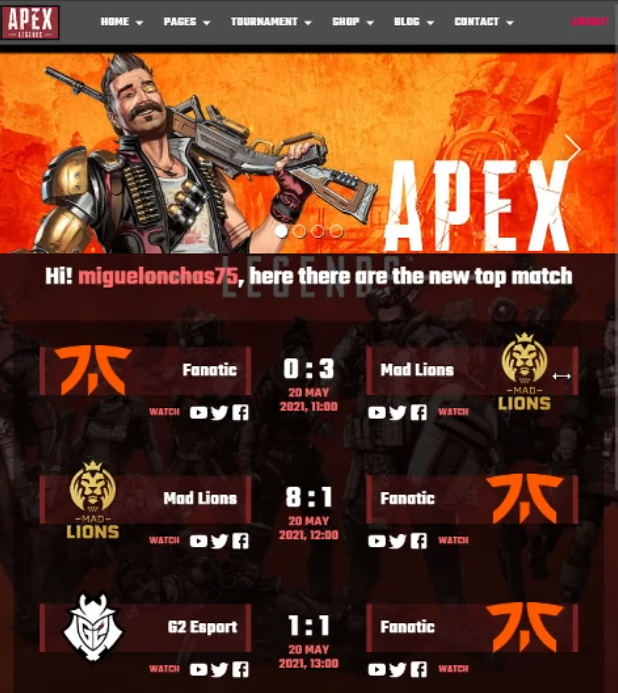

# REACTJS - REDUX - FLASK

This is a working small example full stack project about a simple API REST made with the micro framework Flask for python and a client with React js using GSAP and MaterialUI

- This repository is divided by client and server
- You can see the api available request at [Postman request.json](./server/postman_collection.json)
- You can find the database dub at [flask-rest-api-dumb.sql](./flask-rest-api-dumb.sql) (Database name must be "flask-rest-api" or you can configure the db uri at [config.py](./server/app/main/config.py)

# Stack services information
- You can find more information about the backend service at [BACKEND README.md](./server/README.md)

- You can find more information about the client service at [CLIENT README.md](./client/README.md)

## Client preview

