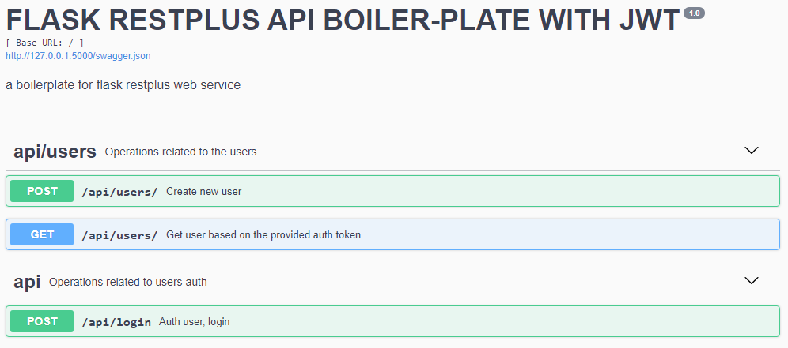

<div align="center">

  
  
  # Flask REST API 

</div>


## Technologies used
* **[Python3](https://www.python.org/downloads/)** - A programming language that lets you work more quickly (The universe loves speed!).
* **[Flask](flask.pocoo.org/)** - A microframework for Python based on Werkzeug, Jinja 2 and good intentions
* **[Virtualenv](https://virtualenv.pypa.io/en/stable/)** - A tool to create isolated virtual environments
* **[PostgreSQL](https://www.postgresql.org/download/)** – Postgres database offers many [advantages](https://www.postgresql.org/about/advantages/) over others.
* Minor dependencies can be found in the requirements.txt file on the root folder.

## Installation / Usage
* If you wish to run your own build, first ensure you have python3 globally installed in your computer. If not, you can get python3 [here](https://www.python.org).
* After this, ensure you have installed virtualenv globally as well. If not, run this:
    ```
        $ pip install virtualenv
    ```


* #### Dependencies
    1. Create and fire up your virtual environment in python3:
        ```
        $ py -3 -m venv venv
        ```

### Start environment state
``
.\venv\Scripts\activate
``

### Install requirements
```
(venv)$ pip install -r requirements.txt
```

### Run migrations
- ```python manage.py db init```
- ```python manage.py db migrate```
- ```python manage.py db upgrade```

### Run API
```python manage.py run```

## API ENDPOINTS

- **GET** - ```/api/users - Get user based on the auth token ```
- **POST** - ```/api/users/ - create new user ```
- **POST** - ```/api/login - Get user auth token```

## EXTRA
You can find more info about the endpoints by starting the server and displaying the swagger documentation or using the [postman_collection.json](./postman_collection.json)




